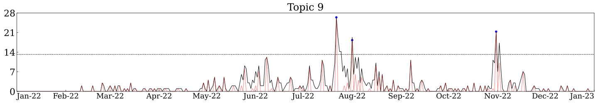

# Monitoring the Russo-Ukrainian War Through Media

## About
This repository is a reproduction package for Resonant Journalism in the Russo-Ukrainian War: A Topic Modeling Approach to Key-Point Detection, the thesis for my BSc in Economics (Universidade de Brasília - Brazil)

This study sheds light on the potential of unstructured data for the detection of major happenings in global events. We detect key points of the Russo-Ukrainian War using topic modeling on a newly curated, large-scale dataset of news stories and investigate whether the differences in topic distributions can highlight unique trendsetting potentials in reporting across major news outlets.

#### LDA sheds light on major events throughout the corpus:

#### Persistent Homology helps us find peak dates:

#### Kullback-Leibler Divergence allows us to probe for a bias towards innovation in reporting:

## In this repo:
### Working scrapers for 11 news outlets:
- ABC, AP, CBS, CNN, DailyMail, Express, Fox, Guardian, Mirror, NY Times, Reuters

### Topic Analysis
- (Barron et al. 2018) Implementation of latent Dirichlet allocation (LDA)
- KLD-Based measures of Novelty, Resonance and Transience

### Plotting notebooks
